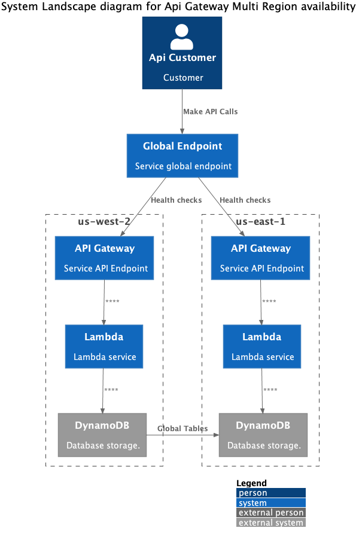

# multi-region-with-apigw-lambda-ddb
Exemple of building a Multi-region Serverless Application with Amazon API Gateway, AWS Lambda, DynamoDB Global tables, Route53 health-checks and infrastructure as code (CDK).

This is work in progress and currently assumes the DNS domain is `iulianm.dev`.

The stack would create ApiGateway+ACM+Lambda in `us-east-1` and `us-west-2`.

Each region would have the following APIGateway custom domains:
 * `api.iulianm.dev`
 * `api.<region>.iulianm.dev`

This guide makes use of [SIGV4A](https://docs.aws.amazon.com/general/latest/gr/signing_aws_api_requests.html) which is an extension that enables signatures that are valid in more than one AWS Region.




# Welcome to your CDK TypeScript project

This is a blank project for TypeScript development with CDK.

The `cdk.json` file tells the CDK Toolkit how to execute your app.

## Useful commands

* `npm run build`   compile typescript to js
* `npm run watch`   watch for changes and compile
* `npm run test`    perform the jest unit tests
* `cdk deploy`      deploy this stack to your default AWS account/region
* `cdk diff`        compare deployed stack with current state
* `cdk synth`       emits the synthesized CloudFormation template


## Synthesize synthesized CloudFormation template

```bash
cdk synth
```

## Deploy DNS stack
```bash
cdk deploy DnsStack
```

## Deploy PDX stack
```bash
cdk deploy MultiRegionWithApigwLambdaDdbStack-PDX
```

## Deploy IAD stack
```bash
cdk deploy MultiRegionWithApigwLambdaDdbStack-IAD
```

# Client

Got to `client` directory.
```
pip install -r requirements.txt
```

Start `ipython`:

```python
import requests
from sigv4a_sign import SigV4ASign

service = 'execute-api'
region = '*'
method = 'GET'
url = 'https://api.iulianm.dev'


def make_call():
    headers = SigV4ASign().get_headers_basic(service, region, method, url)
    r = requests.get(url, headers=headers)
    return r

print(f'status_code: {make_call().status_code} \nobject text: {make_call().text}')
```

Output:

```
print(f'status_code: {make_call().status_code} \nobject text: {make_call().text}')
status_code: 200
object text: {"Region ": "us-west-2"}

print(f'status_code: {make_call().status_code} \nobject text: {make_call().text}')
status_code: 200
object text: {"Region ": "us-east-1"}
```